  <picture>
    <source media="(prefers-color-scheme: dark)" srcset="./dark2.svg">
    
  </picture>

<h1 align="center">Hi 👋, I'm Shankar Patil</h1>
<h3 align="center">Computer Science Engineering Graduate | Full Stack Developer | AI/ML Enthusiast</h3>

## 👨‍💻 About Me

I'm a Computer Science Engineering graduate and aspiring Software Engineer passionate about building practical, scalable, and intelligent software solutions.

- 🚀 Passionate about **Full Stack Development, AI/ML, and Generative AI**
- 💻 Building **real-world software applications** that solve practical problems
- 🤖 Interested in **AI-powered applications and intelligent systems**
- 🧠 Improving my skills in **Java, Spring Boot, DSA, Full Stack Development, and Generative AI**
- 🔍 Enjoy **problem solving, learning new technologies, and exploring innovative ideas**
- 🏆 Hands-on experience through **internships, hackathons, and real-world project development**
- 🎯 Goal: Become a skilled **Software Engineer** and build impactful technology

---

## 🛠️ Tech Stack

### 💻 Programming Languages

  

### 🌐 Web Technologies

  

### 🎨 Frontend Development

  

  <b>JavaScript • TypeScript • React • HTML5 • CSS3 • Tailwind CSS</b>

### ⚙️ Backend Development

  

  <b>Java • Spring Boot • Python • Flask • FastAPI • REST APIs • JWT Authentication</b>

### 🗄️ Databases & ORM

  

  <b>MySQL • PostgreSQL • MongoDB • Firebase • Hibernate • JPA • SQLAlchemy</b>

### 🤖 AI / ML & Generative AI

  

  <b>Scikit-learn • Google GenAI • LangChain • Ollama • OpenCV • DeepFace • TensorFlow</b>

### 🧬 Data Science & Scientific Computing

  <b>RDKit • AutoDock Vina • OpenBabel • Molecular Fingerprinting • ADMET Profiling • Bioinformatics</b>

### 🔐 Security & Cryptography

  <b>Spring Security • JWT • AES • RSA • PyCryptodome • Image Steganography</b>

### 🧰 Development Tools & DevOps

  

  <b>Git • GitHub • Docker • Maven • Postman • VS Code</b>

---

## 🎯 Areas of Interest

- Full Stack Web Development
- Artificial Intelligence & Machine Learning
- Generative AI
- Backend Development
- Data Structures & Algorithms
- Problem Solving
- Computer Vision
- Software Engineering
- Building Practical Software Solutions

---

## 📌 Currently Exploring

- ☕ Advanced Java & Spring Boot
- 🧩 Data Structures & Algorithms
- 🤖 Generative AI & LLM Applications
- 🔗 Retrieval-Augmented Generation (RAG)
- 🐳 Docker & Application Deployment
- 🌐 Scalable Full Stack Application Development

---

## 🤝 Let's Connect

  
  

---

  <i>💡 Building. Learning. Solving. Growing.</i>

